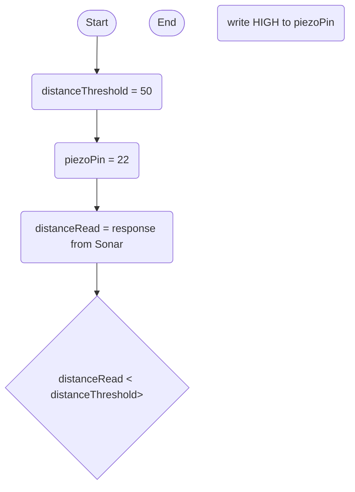

```mermaid
flowchart TD
    terminalStart([Start])
    terminalEnd([End])
    thresholdSet(distanceThreshold = 50)
    setPiezoPin(piezoPin = 22)
    currentDistanceReading(distanceRead = response from Sonar)
    activatePiezo(write HIGH to piezoPin)
    ifDistanceLessThanThreshold{distanceRead < distanceThreshold>}

    terminalStart --> thresholdSet --> setPiezoPin
    setPiezoPin --> currentDistanceReading
    currentDistanceReading --> ifDistanceLessThanThreshold
```