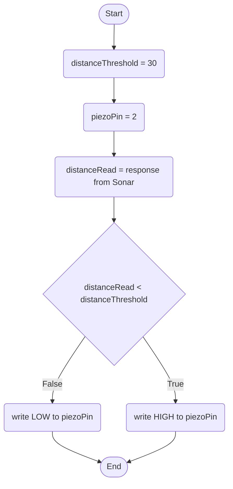
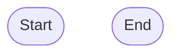

Behaviour: 1. When a person gets too close (sonar) to the house, an alarm is sounded (piezo).

Behaviour 2: When the garage door button is pressed (button) the Door Opens (servo) and the red light is turned on (Traffic Light Red LED). There is a pause for 5 seconds, then the door is closed and the light turned off.

